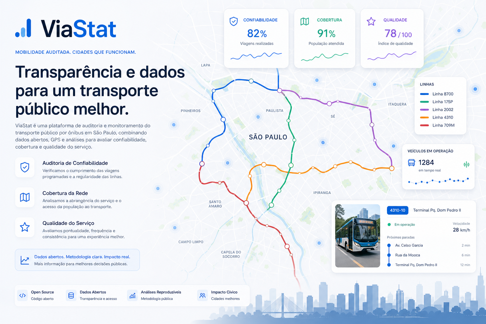
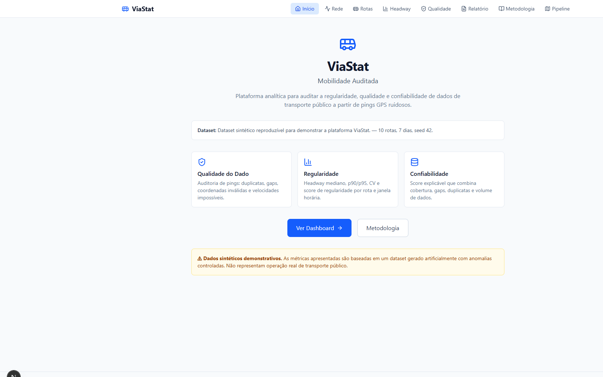
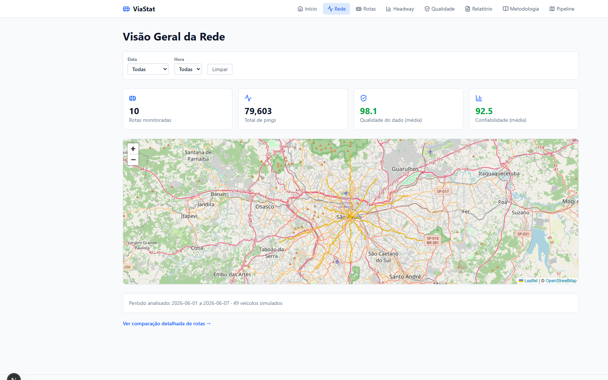
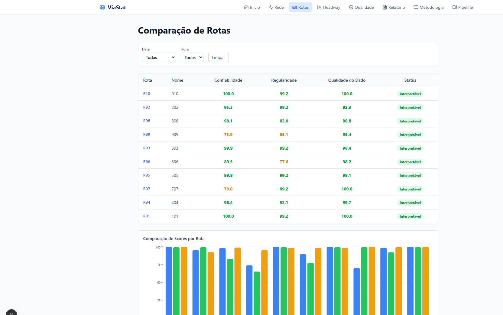
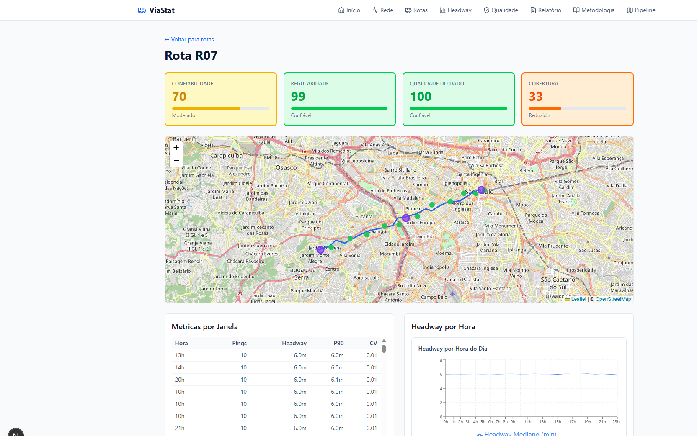
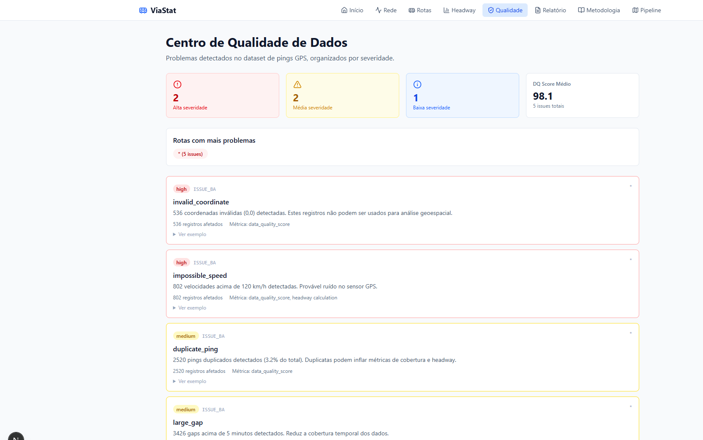
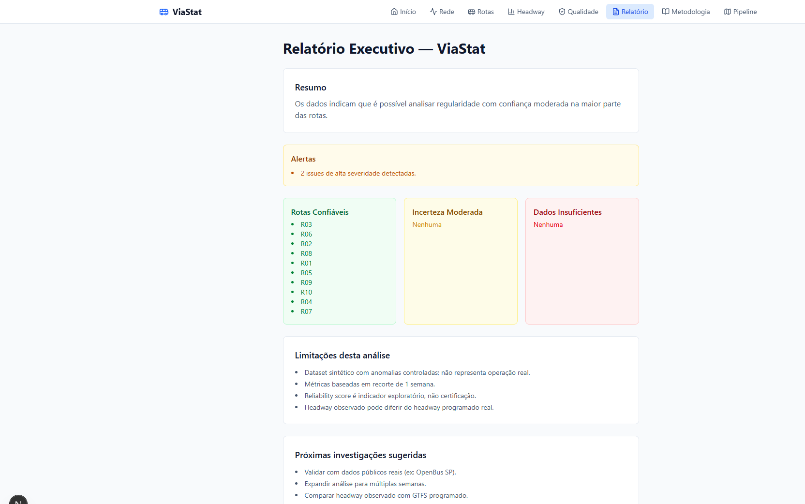
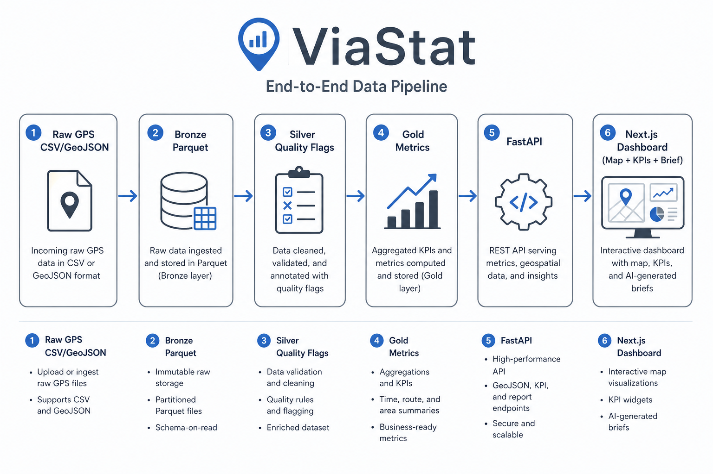

<div align="center">
  

  <h1>ViaStat</h1>

  <p><strong>Auditoria de regularidade, qualidade e confiabilidade para dados GPS de transporte público.</strong></p>
  <p><strong>Auditable regularity, quality and reliability analytics for noisy public-transit GPS pings.</strong></p>

  <p>
    <a href="#-visão-geral--overview">PT-BR / English Overview</a> •
    <a href="#-product-preview">Preview</a> •
    <a href="#-screenshots">Screenshots</a> •
    <a href="#-stack--tecnologias">Stack</a> •
    <a href="#-arquitetura--architecture">Architecture</a> •
    <a href="#-quick-start--início-rápido">Quick Start</a> •
    <a href="#-autor--author">Author</a>
  </p>

  <p>
    <a href="https://representation-mpg-reflect-stylus.trycloudflare.com">
      
    </a>
    <a href="https://github.com/BarujaFe1/viastat">
      
    </a>
    
    
    
    
    
    
  </p>
</div>

<p align="center">
  
</p>

---

## 1. Visão Geral / Overview

O **ViaStat** é uma plataforma analítica que transforma pings GPS ruidosos de ônibus em métricas auditáveis de **regularidade (headway)**, **cobertura**, **gaps**, **qualidade de dado** e **confiabilidade por rota**.

Em vez de tratar métricas cívicas como verdade absoluta, o ViaStat audita a qualidade do dado antes de calcular indicadores e marca explicitamente quando a janela é **não interpretável**.

O projeto foi desenvolvido por **Felipe Alirio Baruja** como peça de portfólio, combinando engenharia full-stack, pipeline de dados e comunicação responsável de incerteza.

> **Responsible Analytics Notice**  
> O ViaStat foi criado para diagnóstico agregado de qualidade e regularidade operacional. Ele **não deve** ser usado para vigilância individual, ranking de motoristas ou decisões acusatórias sobre pessoas.

---

## ✨ Product Preview

<p align="center">
  
</p>

O ViaStat apresenta uma experiência clara e cívica: KPIs de rede, mapa Leaflet, comparação de rotas, painel de qualidade, relatório executivo determinístico e metodologia documentada.

---

## 2. Por que este projeto importa? / Why this project matters

* **Dados de mobilidade são ruidosos:** pings faltantes, duplicatas, coordenadas inválidas e velocidades impossíveis são comuns.
* **Dashboards cívicos costumam omitir incerteza:** números sem qualidade viram decisões frágeis.
* **Regularidade precisa de auditoria:** headway só faz sentido quando cobertura e qualidade são suficientes.
* **Portfólio full-stack com rigor analítico:** pipeline Parquet + API tipada + dashboard interativo + testes determinísticos.

---

## 🧠 O diferencial do ViaStat / What makes ViaStat different

### Português
O ViaStat não é apenas um mapa de ônibus. Ele combina qualidade de dados, métricas de regularidade e comunicação de incerteza em uma experiência rastreável.

Ele mostra não apenas o que os dados indicam, mas também:
- quão confiável a janela está;
- quais issues de qualidade foram detectados;
- quais rotas são interpretáveis;
- onde a cobertura é insuficiente;
- quais limitações devem restringir a leitura.

### English
ViaStat is not just a transit map. It combines data quality, regularity metrics and uncertainty communication into one traceable experience.

It shows not only what the data says, but also:
- how reliable each window is;
- which quality issues were detected;
- which routes are interpretable;
- where coverage is insufficient;
- which limitations must constrain interpretation.

---

## 🎯 Problema que resolve / The problem it solves

Em fluxos reais de mobilidade, bases GPS costumam chegar com:
- pings duplicados;
- coordenadas inválidas `(0,0)`;
- velocidades impossíveis;
- gaps longos de sinal;
- timestamps fora de ordem;
- cobertura desigual por rota/hora;
- dashboards que exibem métricas sem explicar qualidade.

O **ViaStat** cria uma camada auditável entre o ping bruto e a decisão analítica.

---

## 🧩 Proposta / Analytical Pipeline

```txt
Synthetic GTFS-like GPS dataset (seed 42)
  ↓
Raw CSV / GeoJSON / schedule
  ↓
Bronze Parquet (schema fixo)
  ↓
Silver quality flags (duplicates, invalid coords, speed, out-of-order, gaps)
  ↓
Gold metrics (headway, coverage, regularity, reliability)
  ↓
FastAPI endpoints
  ↓
Next.js dashboard (map, KPIs, quality, brief, methodology)
```

---

## 📸 Screenshots

<table>
  <tr>
    <td width="50%">
      
      <br />
      <sub><strong>Network Overview</strong> — KPIs da rede, filtros data/hora e mapa Leaflet com rotas coloridas por confiabilidade.</sub>
    </td>
    <td width="50%">
      
      <br />
      <sub><strong>Routes Comparison</strong> — tabela interpretável/insuficiente e gráfico comparativo de scores.</sub>
    </td>
  </tr>
  <tr>
    <td width="50%">
      
      <br />
      <sub><strong>Route Detail</strong> — gauges, mapa com pings/paradas, headway por hora e comparação com programado.</sub>
    </td>
    <td width="50%">
      
      <br />
      <sub><strong>Quality Center</strong> — issues por severidade, tipos e impacto nas métricas.</sub>
    </td>
  </tr>
  <tr>
    <td width="50%">
      
      <br />
      <sub><strong>Executive Brief</strong> — resumo determinístico, alertas, rotas confiáveis e limitações.</sub>
    </td>
    <td width="50%">
      
      <br />
      <sub><strong>Home</strong> — posicionamento do produto, dataset sintético e navegação para o dashboard.</sub>
    </td>
  </tr>
</table>

---

## 📌 Estudo de Caso / Case Study

### 📌 Estudo de Caso: Rede sintética de 10 rotas
O dataset demo simula 10 rotas em São Paulo, 7 dias (2026-06-01 a 2026-06-07), ~79.603 pings e anomalias controladas. O pipeline recalibra cobertura contra veículos programados e usa gap relevante >10 min.

Resultados típicos após calibração:
- **R10 (exemplar):** reliability ≈ 100, coverage ≈ 100
- **R07 (low_coverage):** coverage ≈ 33, reliability ≈ 70
- **Issues de qualidade:** duplicate_ping, invalid_coordinate, impossible_speed, timestamp_out_of_order, large_gap

### 📌 Case Study: Synthetic 10-route network
The demo dataset simulates 10 São Paulo routes, 7 days, ~79,603 pings and controlled anomalies. Coverage is calibrated against scheduled vehicles and relevant gaps use a 10-minute threshold.

Typical calibrated outcomes:
- **R10 (exemplar):** reliability ≈ 100, coverage ≈ 100
- **R07 (low_coverage):** coverage ≈ 33, reliability ≈ 70
- **Quality issues:** duplicate_ping, invalid_coordinate, impossible_speed, timestamp_out_of_order, large_gap

---

## 🧭 Visual Story / Jornada Analítica

```txt
1. Abrir a Home e entender o escopo do dataset sintético
2. Ver KPIs e mapa da Rede
3. Comparar rotas e status Interpretável/Insuficiente
4. Abrir detalhe de rota (ex.: R07 e R10)
5. Inspecionar Quality Center e issues
6. Ler o Executive Brief e limitações
7. Conferir Pipeline e Metodologia
```

---

## ⚙️ Funcionalidades Principais / Core Features

### Network Dashboard
KPIs de rotas, pings, qualidade média e confiabilidade média, com filtros de data/hora e mapa Leaflet.

### Route Comparison
Tabela ordenável com scores e badge de interpretabilidade, mais gráfico comparativo.

### Route Detail
Gauges, métricas por janela, série de headway, comparação com programado, mapa com pings/gaps/paradas e issues da rota.

### Quality Center
Issues agregados por severidade/tipo, com impacto nas métricas e exemplos.

### Executive Brief
Relatório determinístico sem linguagem acusatória, com alertas, listas de rotas e limitações.

### Methodology & Anti-scope
Documentação explícita de fórmulas, limites e o que o produto **não** faz.

---

## 🛠️ Stack / Tecnologias

### Frontend
- **Framework:** Next.js 16 (App Router) & React 19
- **Linguagem:** TypeScript
- **Estilização:** Tailwind CSS v4
- **Mapas:** Leaflet / react-leaflet
- **Gráficos:** Recharts
- **Tabela:** TanStack Table
- **Ícones:** Lucide React

### Backend
- **Framework API:** FastAPI & Uvicorn (Python 3.12)
- **Modelagem:** Pydantic v2
- **Processamento:** Polars + Parquet
- **Testes:** Pytest

---

## 🧱 Arquitetura / Architecture

```text
viastat/
├── backend/                 # FastAPI
│   ├── routers/             # health, network, routes, quality, brief, pipeline
│   ├── services/            # loader, metrics, quality, brief
│   ├── schemas/             # modelos Pydantic
│   └── config.py
├── frontend/                # Next.js App Router
│   └── src/
│       ├── app/             # páginas (/network, /routes, /quality, /brief...)
│       ├── components/      # map, charts, ui
│       └── lib/             # api client + types
├── scripts/                 # gerador sintético + pipeline Parquet
├── tests/                   # pytest (backend + pipeline)
├── docs/                    # metodologia, assumptions, case study
├── assets/                  # ícone, hero, screenshots
├── data/                    # gerado localmente (gitignored)
└── README.md
```

---

## 🧱 Visual Architecture

<p align="center">
  
</p>

ViaStat follows a traceable analytical flow: synthetic GPS enters the pipeline, gets standardized, quality-flagged, aggregated into gold metrics and exposed through FastAPI to the Next.js dashboard.

---

## 🔁 Data Flow Pipeline

```txt
Raw Input (CSV / GeoJSON / schedule)
  ↓
Bronze Parquet
  ↓
Silver Quality Flags
  ↓
Gold Metrics (headway / coverage / reliability)
  ↓
FastAPI
  ↓
Dashboard / Executive Brief / Methodology
```

---

## 🚀 Quick Start / Início Rápido

### Live Demo
Demo pública (lab): **[https://representation-mpg-reflect-stylus.trycloudflare.com](https://representation-mpg-reflect-stylus.trycloudflare.com)** → **Abrir Live Demo**.

> **Lab only.** Dataset sintético (seed 42). Não é operação real de transporte público.
>
> **Deploy note:** o projeto já está linkado na Vercel (`barujafe1s-projects/viastat`) com `vercel.json` Services (Next + FastAPI). O deploy de produção ficou bloqueado temporariamente pelo limite diário da conta free (`api-deployments-free-per-day`). Quando a cota resetar:
>
> ```bash
> npx vercel deploy --prod --yes --scope barujafe1s-projects
> ```
>
> URL permanente pretendida: `https://viastat.vercel.app`

### Pré-requisitos
- **Node.js** v20+
- **Python** 3.12
- **Git**

### 1. Gerar dados e pipeline
```bash
cd viastat
python -m venv backend/.venv
backend\.venv\Scripts\activate          # Windows
# source backend/.venv/bin/activate     # Linux/macOS
pip install -r backend/requirements.txt

python scripts/generate_synthetic_gtfs_like_data.py
python scripts/build_parquet_dataset.py
```

### 2. Backend FastAPI
```bash
# a partir da raiz, com venv ativo
uvicorn backend.main:app --reload --port 8000
```
API em [http://127.0.0.1:8000](http://127.0.0.1:8000). Docs em `/docs`.

### 3. Frontend Next.js
```bash
cd frontend
npm install
# opcional: copie .env.example para .env.local
npm run dev
```
Frontend em [http://localhost:3000](http://localhost:3000).

> Se a porta 8000 estiver ocupada, suba o backend em outra porta e defina `NEXT_PUBLIC_API_URL`.

---

## 🧪 Scripts e Testes / Scripts and Testing

### Backend / Pipeline
```bash
# da raiz do repositório, com dados gerados
python -m pytest -q
```

### Frontend
```bash
cd frontend
npm run lint
npm run build
```

---

## 📊 Metodologia / Methodology

- **Headway:** intervalo entre pings consecutivos do mesmo veículo
- **Coverage Score:** `100 × min(1, ping_count / expected_pings)` com esperado baseado em veículos programados
- **Regularity Score:** baseado no CV do headway
- **Data Quality Score:** composição de duplicatas, coords inválidas, velocidades impossíveis, out-of-order e gaps
- **Reliability Score:** composição de cobertura, gaps, duplicatas, volume, consistência e DQ
- **Gap relevante:** silêncio > 10 minutos
- **Não interpretável:** <10 pings, coverage <30% ou duplicatas >50%

Detalhes em [`docs/methodology.md`](./docs/methodology.md) e [`docs/assumptions.md`](./docs/assumptions.md).

---

## 🛡️ Antiescopo e Boas Práticas

- Sem ranking individual de motoristas
- Sem linguagem acusatória (“fraude”, “incompetente”, “motorista ruim”)
- Sem vigilância pessoal
- Sem IA generativa como núcleo analítico
- Sem autenticação/multiusuário no MVP
- Dados sintéticos — não representam operação real

---

## 💼 Valor para Portfólio / Portfolio Value

O ViaStat demonstra competências de **Analytics Engineering**, **Data Engineering** e **Full-Stack**:
- pipeline raw→bronze→silver→gold com Parquet
- qualidade de dados geoespaciais
- métricas estatísticas explicáveis
- API FastAPI tipada
- dashboard Next.js com mapa e gráficos
- comunicação responsável de incerteza

---

## 📚 Documentação Complementar

- [`docs/methodology.md`](./docs/methodology.md) — fórmulas e limites
- [`docs/assumptions.md`](./docs/assumptions.md) — premissas do dataset
- [`docs/data-contracts.md`](./docs/data-contracts.md) — contratos de dados
- [`docs/data-sources.md`](./docs/data-sources.md) — fontes e geração
- [`docs/portfolio-case-study.md`](./docs/portfolio-case-study.md) — case study

---

## 🖼️ GitHub Social Preview

```txt
assets/social-preview.png
```
Dimensão recomendada: 1280×640. Upload em: Repository Settings → Social Preview.

---

## 🔖 GitHub Repository Metadata

### About sugerido
```txt
Auditable regularity, quality and reliability analytics for noisy public-transit GPS pings.
```

### Topics sugeridos
```txt
public-transit
gps-analytics
data-quality
headway
fastapi
nextjs
typescript
python
polars
parquet
leaflet
responsible-analytics
portfolio-project
mobility
```

---

## 👤 Autor / Author

Desenvolvido por **Felipe Alirio Baruja**.

- **Portfolio:** [barujafe.vercel.app](https://barujafe.vercel.app/)
- **GitHub:** [@BarujaFe1](https://github.com/BarujaFe1)
- **LinkedIn:** [Gustavo Felipe Alirio Baruja](https://www.linkedin.com/in/barujafe/)

---

## 📄 Licença / License

MIT License. Copyright (c) 2026 Felipe Alirio Baruja.
